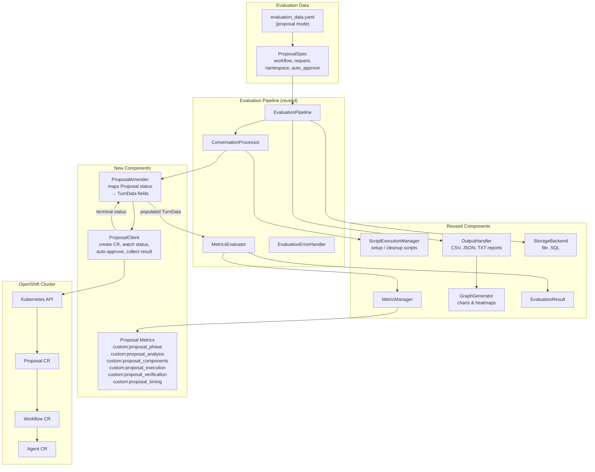
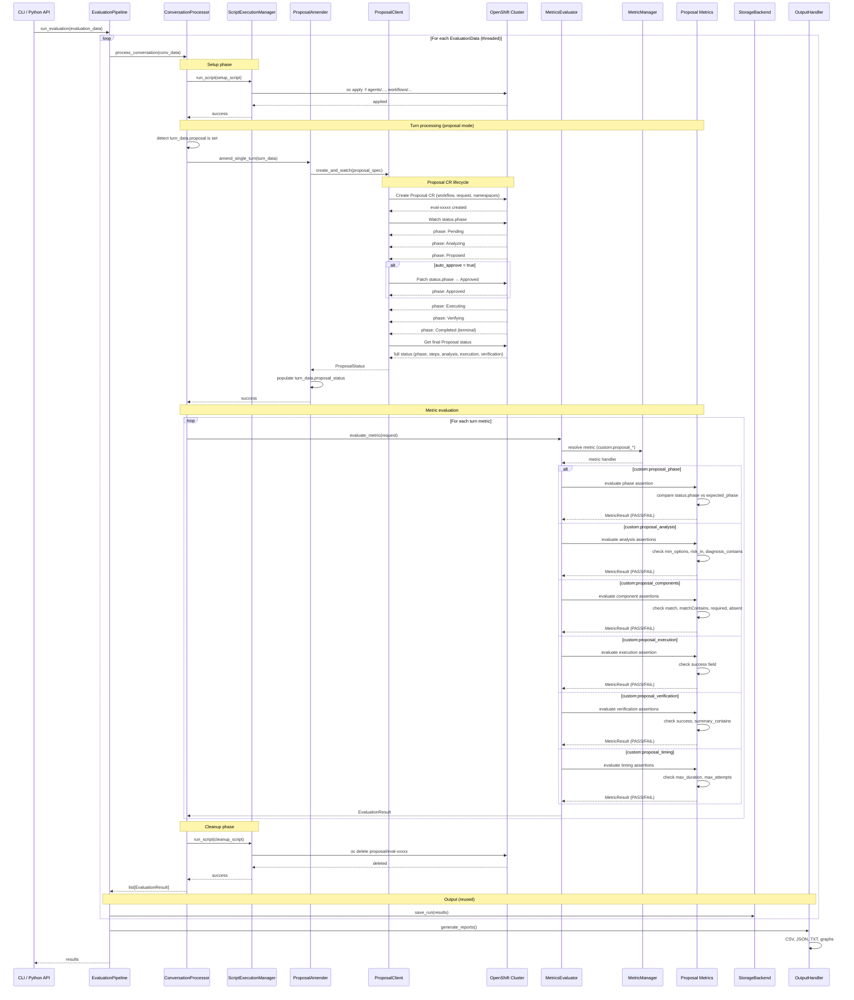

# [DRAFT] Agentic Evaluation Design

This document describes the design for implementing a proposal-based evaluation into the LightSpeed Evaluation Framework.

## Current vs. Proposal-Based Evaluation

### Current flow (query/response)

```
query → APIClient.query() → response → amend TurnData → evaluate metrics
```

The input is a text query. The output is a text response (plus optional tool calls and contexts). Metrics evaluate the response quality.

### Proposal-based flow

```
Proposal CR spec → create CR → watch status → terminal phase → evaluate assertions
```

The input is a Proposal CR spec (workflow, request, target namespaces). The output is the Proposal's terminal status containing structured step results (analysis, execution, verification). Metrics evaluate the structured outcome, not a text response.

There is no query/response cycle. The `request` field inside the Proposal spec is just one input to the agent workflow, not a standalone query.

## Architecture



## What Is Reused

These modules work as-is with no modifications:

| Module | Path | Why it works |
|--------|------|--------------|
| `EvaluationPipeline` | `pipeline/evaluation/pipeline.py` | Orchestrates conversations, threads, storage — mode-agnostic |
| `ConversationProcessor` | `pipeline/evaluation/processor.py` | Already supports setup/cleanup scripts and per-turn metric evaluation |
| `MetricsEvaluator` | `pipeline/evaluation/evaluator.py` | Routes `custom:*` metrics to `CustomMetrics` handler |
| `MetricManager` | `core/metrics/manager.py` | Resolves metric identifiers and merges metadata — works with any `custom:*` metric |
| `EvaluationErrorHandler` | `pipeline/evaluation/errors.py` | Marks turns as ERROR/SKIPPED on failure — mode-agnostic |
| `ScriptExecutionManager` | `core/script/manager.py` | Runs setup/cleanup shell scripts (e.g., `oc apply -f agents/...`) |
| `OutputHandler` | `core/output/generator.py` | Generates reports from `EvaluationResult` — format-agnostic |
| `GraphGenerator` | `core/output/visualization.py` | Visualizations from scored results |
| `StorageBackend` | `core/storage/` | File and SQL persistence of `EvaluationResult` |
| `ConfigLoader` | `core/system/loader.py` | Loads YAML configs — needs minor extension for `proposal` field |
| `DataValidator` | `core/system/validator.py` | Validates evaluation data — needs minor extension |
| `EvaluationResult` | `core/models/data.py` | Result model with score, status, reason — fully reusable |
| `TokenTracker` | `core/llm/token_tracker.py` | Tracks token usage if proposal metrics use LLM judges |
| Caching | `diskcache` in LLM/embedding layers | LLM judge caching works unchanged |

## What Is NOT Reused

These modules are specific to the query/response model and are bypassed (not modified) in proposal mode:

| Module | Path | Why it is not used |
|--------|------|--------------------|
| `APIClient` | `core/api/client.py` | Sends HTTP queries to a streaming/query endpoint — proposals use K8s API |
| `APIDataAmender` | `pipeline/evaluation/amender.py` | Calls `APIClient.query()` and populates TurnData from HTTP response |
| `streaming_parser.py` | `core/api/streaming_parser.py` | Parses SSE events from streaming endpoint |
| `APIConfig` (partially) | `core/models/system.py` | `endpoint_type`, `api_base`, `version` are HTTP-specific — proposal mode needs its own config |
| `APIRequest` / `APIResponse` | `core/models/api.py` | HTTP request/response models — proposals have different I/O |

These modules remain untouched for the existing query/response evaluation mode.

## What Is New

### 1. `ProposalSpec` model

**Location:** `core/models/proposal.py`

Pydantic model representing the Proposal CR spec — the input for proposal-based evaluation.

```python
class ProposalSpec(BaseModel):
    workflow: str                              # Workflow CR name
    namespace: str = "openshift-lightspeed"    # Where to create the Proposal
    request: str = ""                          # Free-text input to the agent
    target_namespaces: list[str] = []          # Namespaces the agent can act on
    auto_approve: bool = True                  # Auto-approve at Proposed phase
    timeout: int = 600                         # Seconds to wait for terminal phase
    max_attempts: int = 3                      # Retry limit in Proposal spec
```

### 2. `ProposalStatus` model

**Location:** `core/models/proposal.py`

Pydantic model representing the collected Proposal CR status after reaching a terminal phase. This is what the assertion metrics evaluate.

```python
class ProposalStatus(BaseModel):
    phase: str                                          # Terminal phase (Completed, Failed, etc.)
    attempt: int = 0                                    # Which attempt reached terminal
    duration: float = 0.0                               # Wall-clock seconds
    analysis: Optional[AnalysisStepStatus] = None       # Analysis step results
    execution: Optional[ExecutionStepStatus] = None     # Execution step results
    verification: Optional[VerificationStepStatus] = None  # Verification step results

class AnalysisStepStatus(BaseModel):
    phase: str = ""
    options: list[RemediationOption] = []

class RemediationOption(BaseModel):
    diagnosis: DiagnosisData = DiagnosisData()
    risk: str = ""
    confidence: str = ""
    components: list[dict[str, Any]] = []

class DiagnosisData(BaseModel):
    summary: str = ""
    root_cause: str = ""

class ExecutionStepStatus(BaseModel):
    phase: str = ""
    success: Optional[bool] = None

class VerificationStepStatus(BaseModel):
    phase: str = ""
    success: Optional[bool] = None
    summary: str = ""
```

### 3. `ProposalClient`

**Location:** `core/api/proposal_client.py`

Handles the Proposal CR lifecycle: create, watch, auto-approve, collect terminal status.

```python
class ProposalClient:
    def create_and_watch(self, spec: ProposalSpec) -> ProposalStatus:
        """Create a Proposal CR and watch until terminal phase.

        1. Build Proposal CR from spec
        2. Apply to cluster via K8s API (or oc/kubectl)
        3. Watch status.phase transitions
        4. Auto-approve at Proposed phase if configured
        5. On terminal phase (Completed/Failed/Escalated/Denied):
           read final status and return ProposalStatus
        """
```

Implementation options:
- **`kubernetes` Python client** — direct K8s API access, watch support, typed
- **Shell out to `oc`/`kubectl`** — simpler, reuses `ScriptExecutionManager`, requires polling instead of watch

### 4. `ProposalAmender`

**Location:** `pipeline/evaluation/proposal_amender.py`

Replaces `APIDataAmender` for proposal mode. Calls `ProposalClient.create_and_watch()` and populates `TurnData` fields from the result.

```python
class ProposalAmender:
    def amend_single_turn(self, turn_data: TurnData) -> Optional[str]:
        """Create proposal, watch, and populate turn_data.

        1. Read turn_data.proposal (ProposalSpec)
        2. Call proposal_client.create_and_watch(spec)
        3. Store ProposalStatus on turn_data.proposal_status
        4. Optionally populate turn_data.response with diagnosis summary
        5. Return error message on failure, None on success
        """
```

### 5. Proposal assertion metrics

**Location:** `core/metrics/custom/proposal_eval.py`

Custom metrics that evaluate `ProposalStatus` against expectations defined in `turn_metrics_metadata`. Each metric maps directly to an assertion type from the operator's `assert.go`.

| Metric | Evaluates | Metadata fields |
|--------|-----------|-----------------|
| `custom:proposal_phase` | Terminal phase matches expectation | `expected_phase`, `phase_in` |
| `custom:proposal_timing` | Completed within time/attempt limits | `max_duration`, `max_attempts` |
| `custom:proposal_analysis` | Analysis step produced expected options | `min_options`, `options[*].risk_in`, `options[*].confidence_in`, `options[*].diagnosis_contains` |
| `custom:proposal_components` | Structured output fields match expectations | `options[*].components[*].match`, `match_contains`, `required`, `absent`, `min_count` |
| `custom:proposal_execution` | Execution step succeeded/failed | `success` |
| `custom:proposal_verification` | Verification step result and summary | `success`, `summary_contains` |

These metrics return standard `MetricResult` (score 0 or 1, PASS/FAIL, reason string), so all downstream output, storage, and visualization works unchanged.

### 6. `TurnData` model extension

**Location:** `core/models/data.py`

Add two optional fields:

```python
class TurnData(StreamingMetricsMixin):
    # ... existing fields ...

    # Proposal-based evaluation
    proposal: Optional[ProposalSpec] = Field(
        default=None,
        description="Proposal CR spec for proposal-based evaluation",
    )
    proposal_status: Optional[ProposalStatus] = Field(
        default=None,
        description="Collected Proposal status after terminal phase (populated by ProposalAmender)",
    )
```

Validation: either `query` or `proposal` must be set, not both. When `proposal` is set, the pipeline routes through `ProposalAmender` instead of `APIDataAmender`.

### 7. `SystemConfig` / `APIConfig` extension

**Location:** `core/models/system.py`

The `api.endpoint_type` field gains a new value `"proposal"`, or a new top-level config section is added:

```yaml
# Option A: extend endpoint_type
api:
  enabled: true
  endpoint_type: proposal    # "streaming", "query", or "proposal"

# Option B: separate config section (cleaner separation)
proposal:
  enabled: true
  namespace: openshift-lightspeed
  kubeconfig: null           # Uses KUBECONFIG env var if null
```

## Evaluation Data Format

In proposal mode, each eval case is one conversation with one turn. The `proposal` field replaces `query` as the input.

```yaml
- conversation_group_id: healthy-cluster-recommend
  description: A healthy cluster should get a recommend decision
  tag: cvo-advisory-happy-path

  setup_script: scripts/ota-advisory-setup.sh
  cleanup_script: scripts/ota-advisory-teardown.sh

  turns:
    - turn_id: proposal
      proposal:
        workflow: ota-advisory
        namespace: openshift-lightspeed
        auto_approve: true
        timeout: 600
        request: |
          Analyze upgrade readiness for cluster 4.21.5 → 4.21.8.
          ...readiness data JSON...
        target_namespaces: []
        max_attempts: 3

      turn_metrics:
        - custom:proposal_phase
        - custom:proposal_analysis
        - custom:proposal_components

      turn_metrics_metadata:
        custom:proposal_phase:
          expected_phase: Completed

        custom:proposal_analysis:
          min_options: 1

        custom:proposal_components:
          options:
            - index: 0
              components:
                - type: ota_readiness_summary
                  match:
                    decision: recommend
                - type: ota_finding
                  absent: true
```

## Execution Flow

```
EvaluationPipeline.run_evaluation()
  │
  ├── For each conversation (EvaluationData):
  │     │
  │     ├── ConversationProcessor.process_conversation()
  │     │     │
  │     │     ├── ScriptExecutionManager.run_script(setup_script)
  │     │     │     └── e.g., oc apply -f agents/ota-advisor.yaml
  │     │     │
  │     │     ├── For each turn:
  │     │     │     │
  │     │     │     ├── if turn_data.proposal is set:
  │     │     │     │     ProposalAmender.amend_single_turn()
  │     │     │     │       └── ProposalClient.create_and_watch()
  │     │     │     │             ├── Create Proposal CR
  │     │     │     │             ├── Watch status phases
  │     │     │     │             ├── Auto-approve at Proposed
  │     │     │     │             └── Return ProposalStatus at terminal phase
  │     │     │     │
  │     │     │     ├── elif api.enabled:
  │     │     │     │     APIDataAmender.amend_single_turn()  (existing flow)
  │     │     │     │
  │     │     │     └── MetricsEvaluator.evaluate_metric()
  │     │     │           └── custom:proposal_* metrics read turn_data.proposal_status
  │     │     │
  │     │     ├── ScriptExecutionManager.run_script(cleanup_script)
  │     │     │     └── e.g., oc delete proposal/eval-xxxxx
  │     │     │
  │     │     └── return list[EvaluationResult]
  │     │
  │     ├── StorageBackend.save_run(results)       # reused
  │     └── OutputHandler.generate_reports()        # reused
```

### Execution Flow Sequence Diagram



## Mapping: Operator Evals → LightSpeed Evaluation

| Operator concept | LightSpeed evaluation equivalent |
|---|---|
| `EvalSuite` | List of `EvaluationData` in `evaluation_data.yaml` |
| `EvalSuite.metadata.name` | Evaluation run name |
| `EvalSuite.setup` / `teardown` | Suite-level scripts (new, or per-conversation `setup_script`) |
| `EvalCase.name` | `EvaluationData.conversation_group_id` |
| `EvalCase.tags` | `EvaluationData.tag` |
| `EvalCase.workflow` | `TurnData.proposal.workflow` |
| `EvalCase.request` | `TurnData.proposal.request` |
| `EvalCase.targetNamespaces` | `TurnData.proposal.target_namespaces` |
| `EvalCase.timeout` | `TurnData.proposal.timeout` |
| `EvalCase.autoApprove` | `TurnData.proposal.auto_approve` |
| `EvalCase.maxAttempts` | `TurnData.proposal.max_attempts` |
| `EvalCase.setup` / `teardown` | `EvaluationData.setup_script` / `cleanup_script` |
| `EvalCase.expect.phase` | `custom:proposal_phase` metric with `expected_phase` metadata |
| `EvalCase.expect.phaseIn` | `custom:proposal_phase` metric with `phase_in` metadata |
| `EvalCase.expect.maxAttempts` | `custom:proposal_timing` metric with `max_attempts` metadata |
| `EvalCase.expect.maxDuration` | `custom:proposal_timing` metric with `max_duration` metadata |
| `EvalCase.expect.analysis` | `custom:proposal_analysis` metric |
| `EvalCase.expect.analysis.options[*].components` | `custom:proposal_components` metric |
| `EvalCase.expect.execution` | `custom:proposal_execution` metric |
| `EvalCase.expect.verification` | `custom:proposal_verification` metric |
| `EvalResult` | `EvaluationResult` (score, result, reason) |
| `SuiteResult` | OutputHandler summary statistics |
| `--parallel` | `core.max_threads` in `system.yaml` |
| `--tags` | `--filter-tags` CLI flag (existing) |
| `-o json` | `storage.enabled_outputs: [json]` (existing) |

## File Summary

| File | Status | Purpose |
|------|--------|---------|
| `core/models/proposal.py` | **New** | `ProposalSpec`, `ProposalStatus`, and step status models |
| `core/api/proposal_client.py` | **New** | Proposal CR lifecycle (create, watch, approve, collect) |
| `core/metrics/custom/proposal_eval.py` | **New** | Assertion metrics for proposal status evaluation |
| `pipeline/evaluation/proposal_amender.py` | **New** | Bridges ProposalClient output to TurnData |
| `core/models/data.py` | **Modified** | Add `proposal` and `proposal_status` optional fields to `TurnData` |
| `core/models/system.py` | **Modified** | Add proposal config (new endpoint type or section) |
| `core/metrics/manager.py` | **Modified** | Register `custom:proposal_*` metrics |
| `pipeline/evaluation/processor.py` | **Modified** | Route to ProposalAmender when `turn_data.proposal` is set |
| `core/system/validator.py` | **Modified** | Validate `query` XOR `proposal` constraint |
| `config/system.yaml` | **Modified** | Add `proposal_*` metrics metadata and proposal config section |
