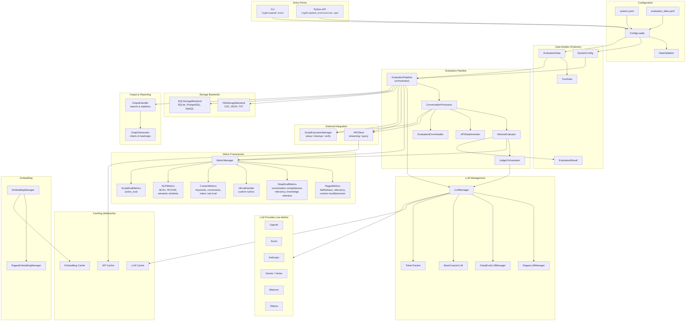

# Architecture

This document describes the high-level architecture of the LightSpeed Evaluation Framework.

## Overview

The LightSpeed Evaluation Framework is an evaluation system for GenAI applications. It takes conversations (query/response pairs), runs them through configurable quality metrics, and produces scored results with reports and visualizations.

The framework supports multiple evaluation backends (Ragas, DeepEval, GEval, custom, NLP, script-based), multi-judge panels, live API integration, and flexible storage.

## Architecture Diagram



## Directory Structure

```
src/lightspeed_evaluation/
├── api.py                    # Programmatic API (evaluate, evaluate_with_summary, etc.)
├── core/
│   ├── api/                  # APIClient for live service integration
│   ├── embedding/            # Embedding providers and caching
│   ├── llm/                  # LLM provider management and framework adapters
│   ├── metrics/              # Metric handlers (Ragas, DeepEval, GEval, Custom, NLP, Script)
│   ├── models/               # Pydantic data models (SystemConfig, EvaluationData, etc.)
│   ├── output/               # Report generation and visualization
│   ├── script/               # Script execution manager
│   ├── storage/              # Storage backends (file, SQL)
│   ├── system/               # Config loading, validation, environment setup
│   └── constants.py          # Default values and framework constants
├── pipeline/
│   └── evaluation/           # Pipeline orchestration (EvaluationPipeline, processors, judges)
└── runner/
    └── evaluation.py         # CLI entry point
```

## Component Details

### Entry Points

There are two ways to use the framework:

- **CLI** (`runner/evaluation.py`) — invoked via `lightspeed-eval --system-config system.yaml --eval-data data.yaml`. Supports filtering by tags and conversation IDs.
- **Python API** (`api.py`) — functions like `evaluate()`, `evaluate_with_summary()`, `evaluate_conversation()`, and `evaluate_turn()` for programmatic use.

### Configuration

Two YAML files drive the system:

- **`system.yaml`** defines the LLM provider/model, judge panel, embedding config, API settings, storage backend, metric thresholds, logging, and visualization options. Parsed into `SystemConfig`.
- **`evaluation_data.yaml`** defines a list of conversations, each containing turns with query, response, contexts, expected values, and optional per-turn metric overrides. Parsed into `EvaluationData` / `TurnData`.

`ConfigLoader` loads the YAML files (or accepts programmatic `SystemConfig` objects) and `DataValidator` runs pre-flight checks to catch configuration issues before expensive LLM calls.

### Data Models

All models use Pydantic v2 and live in `core/models/`:

| Model | Purpose |
|-------|---------|
| `SystemConfig` | Root config — LLM, embedding, API, storage, logging, visualization |
| `LLMPoolConfig` | Named pool of LLM configurations for multi-judge setups |
| `JudgePanelConfig` | Multi-judge evaluation config (judge list, enabled metrics, aggregation) |
| `EvaluationData` | Conversation group — ID, tag, turns, conversation-level metrics, scripts |
| `TurnData` | Single turn — query, response, contexts, expected values, per-turn metrics |
| `EvaluationResult` | Evaluation outcome — metric, score, status, tokens, judge scores |

### Evaluation Pipeline

The pipeline is the core orchestration layer in `pipeline/evaluation/`:

1. **`EvaluationPipeline`** — top-level orchestrator. Initializes all components, iterates over conversations, collects results, and triggers output generation.
2. **`ConversationProcessor`** — processes a single conversation: runs setup scripts, iterates turns, evaluates turn-level metrics, then conversation-level metrics, and runs cleanup scripts.
3. **`MetricsEvaluator`** — evaluates a single metric for a given turn or conversation. Validates required data, routes to the correct framework handler, and returns scored results.
4. **`JudgeOrchestrator`** — manages multi-judge evaluation. For each judge in the panel, calls the metric handler independently, then aggregates scores using the configured strategy (`average`, `max`, or `majority_vote`).
5. **`APIDataAmender`** — updates turn data with responses from live API calls.

### Evaluation Flow

```
For each conversation:
  1. Run setup script (optional)
  2. For each turn:
     a. Call live API if enabled → get response, tool_calls, contexts
     b. For each configured metric:
        - Route to framework handler (Ragas/DeepEval/Custom/NLP/Script)
        - If judge panel enabled: evaluate with each judge, aggregate scores
        - Determine PASS/FAIL based on threshold
  3. Evaluate conversation-level metrics (e.g., conversation completeness)
  4. Run cleanup script (optional)
  5. Persist results to storage backend
  6. Generate reports and visualizations
```

### Metric Frameworks

Metrics are identified as `framework:metric_name` (e.g., `ragas:faithfulness`). The `MetricManager` resolves metrics and merges metadata (thresholds, parameters) with priority: turn-level > conversation-level > system defaults.

| Framework | Metrics | What It Measures |
|-----------|---------|------------------|
| **Ragas** | faithfulness, response_relevancy, context_recall, context_relevance, context_precision | RAG quality — how well the response uses and aligns with retrieved context |
| **DeepEval** | conversation_completeness, conversation_relevancy, knowledge_retention | Conversation quality across multiple turns |
| **GEval** | user-defined | Custom evaluation criteria via rubrics (evaluation_steps, criteria) |
| **Custom** | keywords_eval, answer_correctness, intent_eval, tool_eval | Direct checks — keyword presence, LLM-judged correctness, intent matching, tool call validation |
| **NLP** | bleu, rouge, semantic_similarity_distance | Statistical text similarity (no LLM needed) |
| **Script** | action_eval | External verification via shell/Python scripts |

### LLM Management

`LLMManager` handles provider validation, model name construction, and judge panel coordination. Framework-specific adapters (`RagasLLMManager`, `DeepEvalLLMManager`, `BaseCustomLLM`) translate the generic manager interface into each framework's expected API.

All LLM calls go through [litellm](https://github.com/BerriAI/litellm), supporting OpenAI, Azure, Anthropic, Gemini, Vertex, Watsonx, Ollama, and hosted vLLM.

`TokenTracker` accumulates input/output token counts across all LLM and embedding calls.

### Storage

Storage backends implement the `BaseStorageBackend` protocol:

- **`FileStorageBackend`** — writes CSV, JSON, and TXT reports to a configured output directory.
- **`SQLStorageBackend`** — persists results via SQLAlchemy to SQLite, PostgreSQL, or MySQL.
- **`CompositeStorageBackend`** — combines multiple backends.

A factory function (`create_pipeline_storage_backend`) selects the backend based on configuration.

### Output & Reporting

`OutputHandler` generates evaluation reports with statistics (pass rates, score distributions, per-metric and per-tag breakdowns). `GraphGenerator` produces matplotlib/seaborn visualizations including pass rate charts, score distribution histograms, and metric correlation heatmaps.

### Caching

Three independent disk caches (via `diskcache`) reduce redundant computation:

| Cache | Purpose |
|-------|---------|
| LLM cache | Caches LLM judge responses |
| API cache | Caches responses from live API calls |
| Embedding cache | Caches embedding vectors |

### External Integration

- **`APIClient`** — calls a live GenAI service (e.g., lightspeed-stack) to generate responses before evaluation. Supports streaming and query endpoints with retry logic for rate limiting.
- **`ScriptExecutionManager`** — runs setup, cleanup, and verify scripts (shell or Python) with configurable timeouts. Used for environment preparation (e.g., Kubernetes context) and post-turn verification.

## Design Patterns

| Pattern | Where | Why |
|---------|-------|-----|
| **Adapter** | `RagasLLMManager`, `DeepEvalLLMManager`, `BaseCustomLLM` | Translate generic LLM interface to framework-specific APIs |
| **Strategy** | Judge aggregation (`average`, `max`, `majority_vote`) | Pluggable score aggregation |
| **Protocol** | `BaseStorageBackend` | Interchangeable storage backends |
| **Factory** | `create_pipeline_storage_backend`, metric handler creation | Decouple creation from usage |
| **Lazy Import** | `core/system/lazy_import.py`, `__init__.py` | Defer heavy framework imports until needed |
| **Manager** | `LLMManager`, `EmbeddingManager`, `MetricManager`, `ScriptExecutionManager` | Centralize lifecycle and configuration |
